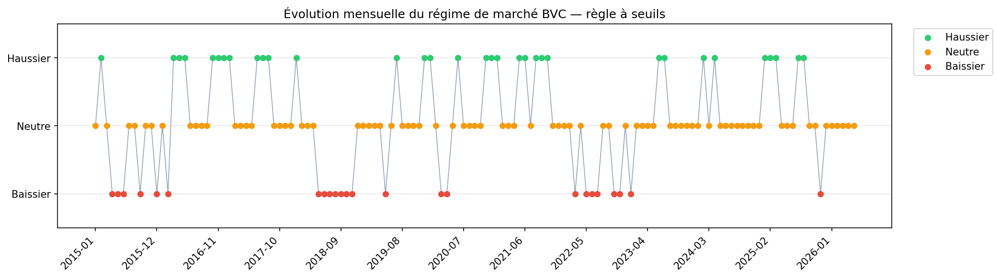

# Évolution mensuelle du régime de marché (Sous-module A — seuils)

- **Généré** : 2026-08-15T10:16:24.315995+00:00
- **Méthode** : Règle à seuils both-AND (q=0.33/0.67) — calibres train ≤ 2020-12-31 (EOM mensuel), appliqués hors train ; remplace GaussianHMM
- **Période** : 2015 → 2026
- **Mois** : 137

## Seuils documentés (train 2015-2020)

- p33_momentum = -0.016704
- p67_momentum = 0.042896
- p33_breadth = 0.392857
- p67_breadth = 0.596491

## Répartition des régimes

- **neutral** : 80
- **bull** : 33
- **bear** : 24

## Dernier mois

- **2026-05** (au 2026-05-18)
- **Régime** : Neutre
- One-hot : bull=0 | neutral=1 | bear=0

## Historique mensuel

| Mois | Régime | is_bull | is_neutral | is_bear |
|------|--------|---------|------------|---------|
| 2015-01 | neutral | 0 | 1 | 0 |
| 2015-02 | bull | 1 | 0 | 0 |
| 2015-03 | neutral | 0 | 1 | 0 |
| 2015-04 | bear | 0 | 0 | 1 |
| 2015-05 | bear | 0 | 0 | 1 |
| 2015-06 | bear | 0 | 0 | 1 |
| 2015-07 | neutral | 0 | 1 | 0 |
| 2015-08 | neutral | 0 | 1 | 0 |
| 2015-09 | bear | 0 | 0 | 1 |
| 2015-10 | neutral | 0 | 1 | 0 |
| 2015-11 | neutral | 0 | 1 | 0 |
| 2015-12 | bear | 0 | 0 | 1 |
| 2016-01 | neutral | 0 | 1 | 0 |
| 2016-02 | bear | 0 | 0 | 1 |
| 2016-03 | bull | 1 | 0 | 0 |
| 2016-04 | bull | 1 | 0 | 0 |
| 2016-05 | bull | 1 | 0 | 0 |
| 2016-06 | neutral | 0 | 1 | 0 |
| 2016-07 | neutral | 0 | 1 | 0 |
| 2016-08 | neutral | 0 | 1 | 0 |
| 2016-09 | neutral | 0 | 1 | 0 |
| 2016-10 | bull | 1 | 0 | 0 |
| 2016-11 | bull | 1 | 0 | 0 |
| 2016-12 | bull | 1 | 0 | 0 |
| 2017-01 | bull | 1 | 0 | 0 |
| 2017-02 | neutral | 0 | 1 | 0 |
| 2017-03 | neutral | 0 | 1 | 0 |
| 2017-04 | neutral | 0 | 1 | 0 |
| 2017-05 | neutral | 0 | 1 | 0 |
| 2017-06 | bull | 1 | 0 | 0 |
| 2017-07 | bull | 1 | 0 | 0 |
| 2017-08 | bull | 1 | 0 | 0 |
| 2017-09 | neutral | 0 | 1 | 0 |
| 2017-10 | neutral | 0 | 1 | 0 |
| 2017-11 | neutral | 0 | 1 | 0 |
| 2017-12 | neutral | 0 | 1 | 0 |
| 2018-01 | bull | 1 | 0 | 0 |
| 2018-02 | neutral | 0 | 1 | 0 |
| 2018-03 | neutral | 0 | 1 | 0 |
| 2018-04 | neutral | 0 | 1 | 0 |
| 2018-05 | bear | 0 | 0 | 1 |
| 2018-06 | bear | 0 | 0 | 1 |
| 2018-07 | bear | 0 | 0 | 1 |
| 2018-08 | bear | 0 | 0 | 1 |
| 2018-09 | bear | 0 | 0 | 1 |
| 2018-10 | bear | 0 | 0 | 1 |
| 2018-11 | bear | 0 | 0 | 1 |
| 2018-12 | neutral | 0 | 1 | 0 |
| 2019-01 | neutral | 0 | 1 | 0 |
| 2019-02 | neutral | 0 | 1 | 0 |
| 2019-03 | neutral | 0 | 1 | 0 |
| 2019-04 | neutral | 0 | 1 | 0 |
| 2019-05 | bear | 0 | 0 | 1 |
| 2019-06 | neutral | 0 | 1 | 0 |
| 2019-07 | bull | 1 | 0 | 0 |
| 2019-08 | neutral | 0 | 1 | 0 |
| 2019-09 | neutral | 0 | 1 | 0 |
| 2019-10 | neutral | 0 | 1 | 0 |
| 2019-11 | neutral | 0 | 1 | 0 |
| 2019-12 | bull | 1 | 0 | 0 |
| 2020-01 | bull | 1 | 0 | 0 |
| 2020-02 | neutral | 0 | 1 | 0 |
| 2020-03 | bear | 0 | 0 | 1 |
| 2020-04 | bear | 0 | 0 | 1 |
| 2020-05 | neutral | 0 | 1 | 0 |
| 2020-06 | bull | 1 | 0 | 0 |
| 2020-07 | neutral | 0 | 1 | 0 |
| 2020-08 | neutral | 0 | 1 | 0 |
| 2020-09 | neutral | 0 | 1 | 0 |
| 2020-10 | neutral | 0 | 1 | 0 |
| 2020-11 | bull | 1 | 0 | 0 |
| 2020-12 | bull | 1 | 0 | 0 |
| 2021-01 | bull | 1 | 0 | 0 |
| 2021-02 | neutral | 0 | 1 | 0 |
| 2021-03 | neutral | 0 | 1 | 0 |
| 2021-04 | neutral | 0 | 1 | 0 |
| 2021-05 | bull | 1 | 0 | 0 |
| 2021-06 | bull | 1 | 0 | 0 |
| 2021-07 | neutral | 0 | 1 | 0 |
| 2021-08 | bull | 1 | 0 | 0 |
| 2021-09 | bull | 1 | 0 | 0 |
| 2021-10 | bull | 1 | 0 | 0 |
| 2021-11 | neutral | 0 | 1 | 0 |
| 2021-12 | neutral | 0 | 1 | 0 |
| 2022-01 | neutral | 0 | 1 | 0 |
| 2022-02 | neutral | 0 | 1 | 0 |
| 2022-03 | bear | 0 | 0 | 1 |
| 2022-04 | neutral | 0 | 1 | 0 |
| 2022-05 | bear | 0 | 0 | 1 |
| 2022-06 | bear | 0 | 0 | 1 |
| 2022-07 | bear | 0 | 0 | 1 |
| 2022-08 | neutral | 0 | 1 | 0 |
| 2022-09 | neutral | 0 | 1 | 0 |
| 2022-10 | bear | 0 | 0 | 1 |
| 2022-11 | bear | 0 | 0 | 1 |
| 2022-12 | neutral | 0 | 1 | 0 |
| 2023-01 | bear | 0 | 0 | 1 |
| 2023-02 | neutral | 0 | 1 | 0 |
| 2023-03 | neutral | 0 | 1 | 0 |
| 2023-04 | neutral | 0 | 1 | 0 |
| 2023-05 | neutral | 0 | 1 | 0 |
| 2023-06 | bull | 1 | 0 | 0 |
| 2023-07 | bull | 1 | 0 | 0 |
| 2023-08 | neutral | 0 | 1 | 0 |
| 2023-09 | neutral | 0 | 1 | 0 |
| 2023-10 | neutral | 0 | 1 | 0 |
| 2023-11 | neutral | 0 | 1 | 0 |
| 2023-12 | neutral | 0 | 1 | 0 |
| 2024-01 | neutral | 0 | 1 | 0 |
| 2024-02 | bull | 1 | 0 | 0 |
| 2024-03 | neutral | 0 | 1 | 0 |
| 2024-04 | bull | 1 | 0 | 0 |
| 2024-05 | neutral | 0 | 1 | 0 |
| 2024-06 | neutral | 0 | 1 | 0 |
| 2024-07 | neutral | 0 | 1 | 0 |
| 2024-08 | neutral | 0 | 1 | 0 |
| 2024-09 | neutral | 0 | 1 | 0 |
| 2024-10 | neutral | 0 | 1 | 0 |
| 2024-11 | neutral | 0 | 1 | 0 |
| 2024-12 | neutral | 0 | 1 | 0 |
| 2025-01 | bull | 1 | 0 | 0 |
| 2025-02 | bull | 1 | 0 | 0 |
| 2025-03 | bull | 1 | 0 | 0 |
| 2025-04 | neutral | 0 | 1 | 0 |
| 2025-05 | neutral | 0 | 1 | 0 |
| 2025-06 | neutral | 0 | 1 | 0 |
| 2025-07 | bull | 1 | 0 | 0 |
| 2025-08 | bull | 1 | 0 | 0 |
| 2025-09 | neutral | 0 | 1 | 0 |
| 2025-10 | neutral | 0 | 1 | 0 |
| 2025-11 | bear | 0 | 0 | 1 |
| 2025-12 | neutral | 0 | 1 | 0 |
| 2026-01 | neutral | 0 | 1 | 0 |
| 2026-02 | neutral | 0 | 1 | 0 |
| 2026-03 | neutral | 0 | 1 | 0 |
| 2026-04 | neutral | 0 | 1 | 0 |
| 2026-05 | neutral | 0 | 1 | 0 |
